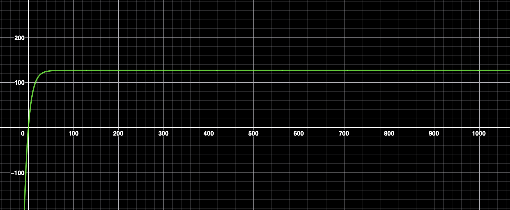

**Zamiana układu współrzędnych na sferyczny**

Zacząłem od przekształcenia układu współrzędnych na układ sferyczny, ponieważ omawialiśmy to na wykładzie z fizyki. Zauważyłem przy tym podobieństwo między współrzędnymi sferycznymi a dwoma kątami, które wymagane są do sterowania silnikami. W tym celu wykorzystałem następujące wzory:

**_Współrzędne sferyczne (r, θ, φ) w zależności od kartezjańskich (x, y, z):_**

$r = \sqrt{x^2 + y^2 + z^2} $

$θ = \arctan2(y, x) $

$φ = \arccos\left(\frac{z}{r}\right) $

 

**Klasa Points**

Stworzyłem klasę Points, która pozwala na tworzenie obiektów reprezentujących punkty i zarządzanie nimi w programie. Klasa ta zawiera metody umożliwiające obliczenie wymaganych kątów do ustawienia silników w osiach X i Y.

 

**Ustawianie prędkości silników**

Do ustawiania prędkości silników wykorzystuję funkcję speedFormula, która określa zarówno kierunek, jak i wartość prędkości. Prędkość obliczana jest na podstawie funkcji matematycznej:

 

 $127 \left( 1 - e^{-x/20} \right)$

  

**_Silnik rozpędza się do maksymalnej prędkości, a w miarę zbliżania się do punktu docelowego prędkość gwałtownie spada, co umożliwia optymalne sterowanie ruchem._**

 

**Tryb kolejki (queue)**

Gdy program uruchamiany jest z argumentem queue, używana jest funkcja, która korzystając z poprzednich metod, kieruje silniki w stronę obiektu Point przekazanego do funkcji. Gdy silniki zbliżą się na odległość mniejszą niż ustawiony wcześniej procent błędu (errorPercent), punkt zostaje oznaczony jako osiągnięty, a funkcja przechodzi do kolejnych zadań.

 

**Tryb wywłaszczenia (preempt)**

Jeżeli program uruchomiony zostanie z argumentem preempt, silniki dążą do punktu currentPoint, który aktualizuje się w momencie pojawienia się nowego celu.

